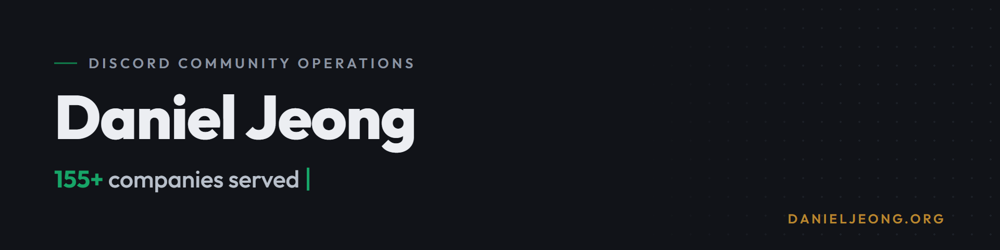

I manage Discord communities for a living and build the automation they run on. So far that's 155+ companies and 12,000+ hours inside Discord. The largest of them grew to 1.7 million members while I ran it.

The client side lives at [danieljeong.org](https://danieljeong.org). This profile is the builder side.

## Proof, not adjectives

- I managed **BlueWillow.ai**'s Discord as it grew from 1,000 to 1.7 million members, the 2nd largest server in the world at the time, and it held a 15% engagement rate at that size.
- I spent a year and a half as **Head of Moderation at Google Developer Groups**, running the mod team for one of the largest developer communities anywhere.
- At **Sapien.io**, I took an 80,000-member Web3 and AI server that had turned into a complaint hub and rebuilt it into a working developer community with 24/7 mod coverage.
- The other 150 or so engagements were smaller: server builds, moderation setups, bot builds, engagement programs. Eighteen of those clients wrote reviews. All eighteen came back five stars.

## What I build

Off-the-shelf bots rarely do what a server actually needs, so I build the missing piece. Sixteen custom bots and automation systems so far, nearly all shipped inside private client servers rather than public repos. The commit graph undersells it.

| Layer | What I work with |
|---|---|
| Custom bots | CC Bot, YAGPDB, Sapphire, Dyno, Discord.js |
| Safety | AutoMod regex, anti-raid, verification gates, spam and scam filters |
| Onboarding and engagement | Welcome flows, reaction roles, leveling and XP, ticket systems |
| Embeds and announcements | Discohook Components v2, webhook pipelines |
| Motion assets | Animated server banners: HTML → Playwright → ffmpeg pipeline |
| Integrations | Custom MCP servers in TypeScript, CRM webhooks, agentic AI workflows |

## How I think about community

When a server feels dead, the cause is usually structural. New members land with no obvious next step, channels give people nothing to respond to, and moderation shows up only after something breaks. I fix the architecture first, because engagement follows it.

That's also why I don't sell member growth. The members a brand has already earned are worth more than any number I could inflate. My job is making sure those people stay.

## Currently

- Running Daniel Jeong LLC full time
- Shipping bot and automation work for client servers most weeks
- Writing [field notes on community operations](https://danieljeong.org/articles)
- Taking new clients for Q3 2026

## Work with me

If your server was built wrong, I'll tell you directly. Services and pricing are on the site, and my DMs are open on LinkedIn and X.

