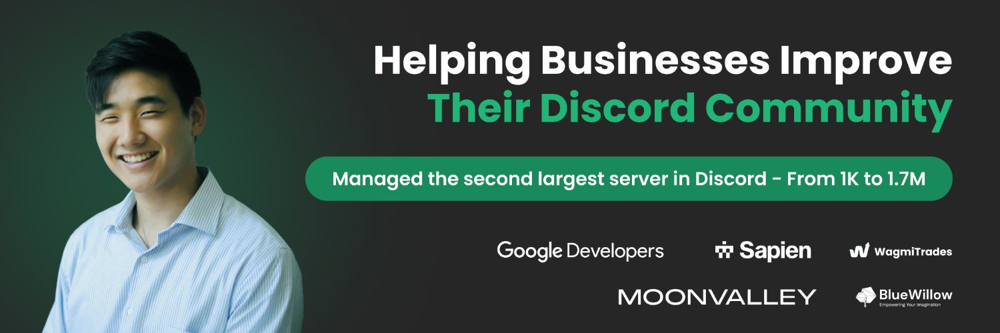

I manage Discord communities for a living and build the automation they run on. So far that's 155+ companies and 12,000+ hours inside Discord. The largest of them grew to 1.7 million members while I ran it.

The client side lives at [danieljeong.org](https://danieljeong.org). This profile is the builder side.

## Proof, not adjectives

- I managed **BlueWillow.ai**'s Discord as it grew from 1,000 to 1.7 million members, the 2nd largest server in the world at the time, and it held a 15% engagement rate at that size.
- I spent a year and a half as **Head of Moderation at Google Developer Groups**, running the mod team for one of the largest developer communities anywhere.
- At **Sapien.io**, I took an 80,000-member Web3 and AI server that had turned into a complaint hub and rebuilt it into a working developer community with 24/7 mod coverage.
- The other 150 or so engagements were smaller: server builds, moderation setups, bot builds, engagement programs. Eighteen of those clients wrote reviews. All eighteen came back five stars.

## Companies I've worked with

**The names behind the logos:**

- **[Google Developers](https://developers.google.com)**: Google's global developer community. Head of Moderation for Google Developer Groups for 1.5 years.
- **[Sapien](https://sapien.io)**: Web3 and AI data foundry. Rebuilt and ran its 80,000-member Discord.
- **WagmiTrades**: crypto trading community.
- **[Moonvalley](https://moonvalley.com)**: AI video generation company.
- **[BlueWillow](https://www.bluewillow.ai)**: AI image generation. Grew its Discord from 1,000 to 1.7 million members.
- **[Live Traders](https://livetraders.com)**: trading education and live trading rooms.
- **[Pure Daily Care](https://puredailycare.com)**: skincare and wellness devices brand. Moderation engagement.
- **[Parryverse](https://www.roblox.com/communities/361311171/Parryverse)**: Parry Gripp's official Roblox universe. Discord community work.
- **[TMMB](https://tmmbagency.com)**: TikTok Shop affiliate agency. Coaching community server build.
- **[MSK Labs](https://www.msklabs.com)**: sunless tanning beauty brand. Affiliate creator Discord.
- **[Enrich Trades](https://enrichtrades.com)**: options trading mentorship community.
- **[Terez & Honor](https://terezandhonor.com)**: skincare brand. Creator community onboarding.
- **[Hellava](https://www.hellava.co)**: functional gummy supplement brand.
- **[The Artillery](https://whop.com/tiktok-exitoso-digital-ent/)**: TikTok Shop creator and UGC community.
- **[NerdFocus](https://nerdfocus.com)**: nootropic focus energy drink.
- **[Mangrove](https://mangrove.ai)**: AI-powered digital asset trading platform.
- **[Fomo.ai](https://fomo.ai)**: AI search marketing platform.
- **[Gleam](https://trygleam.app)**: social skills training app.
- **[Varsity Gripz](https://www.varsitygripz.com)**: licensed gaming controller grips.
- **[Visual Sectors](https://visualsectors.com)**: options data trading indicators.
- **[DianToz](https://diantoz.com)**: sci-fi YouTube storytelling universe.
- **[AppleCore](https://www.applecore.trade)**: trading education community.
- **[Vetted](https://www.vetted.cv)**: invite-only network for elite video creators.
- **[No Gimmicks Recs](https://www.nogimmicksrecs.com)**: independent house music label.
- **[Virtus Capital](https://www.virtuscapital.io)**: algorithmic wealth management.
- **[Junk Bond Investor](https://www.junkbondinvestor.com)**: high-yield and distressed credit analysis newsletter.
- **[Pinkfish](https://www.pinkfish.ai)**: enterprise AI agent platform, acquired by Genesys.
- **[AgentVoice](https://agentvoice.com)**: AI voice agents for business phone operations.
- **[Commerce Social](https://commercesocial.co)**: TikTok Shop commerce agency.
- **[Collab Collective](https://collabcollective.us)**: vetted creator community for TikTok Shop brand deals.
- **[Kaido](https://gokaido.com/marketplace)**: anime and fandom marketplace.
- **[Silo Finance](https://www.silo.finance)**: decentralized lending protocol.
- **[WE Global Marketing](https://www.weglobalmarketing.com)**: certified TikTok Shop partner agency.

## Automations, workflows, and AI integrations

Most of what I build ships inside private client servers, so the commit graph undersells it. To find out which automations, custom bots, workflows, and AI integrations would fit your community best, head to [danieljeong.org](https://danieljeong.org/bots).

## How I think about community

When a server feels dead, the cause is usually structural. New members land with no obvious next step, channels give people nothing to respond to, and moderation shows up only after something breaks. I fix the architecture first, because engagement follows it.

That's also why I don't sell member growth. The members a brand has already earned are worth more than any number I could inflate. My job is making sure those people stay.

## Currently

- Running Daniel Jeong LLC full time
- Shipping bot and automation work for client servers most weeks
- Writing [field notes on community operations](https://danieljeong.org/articles)
- Taking new clients for Q3 2026

## Work with me

If your server was built wrong, I'll tell you directly. That's the [community audit](https://danieljeong.org/discord-community-audit): structure, moderation, onboarding, engagement, and a written action plan. The [first analysis is free](https://danieljeong.org/free-analysis), delivered within 24 hours. My DMs are open on LinkedIn and X, and services and pricing are on the site.

[![LinkedIn](https://img.shields.io/badge/LinkedIn-0077B5?style=for-the-badge&logo=data%3Aimage%2Fsvg%2Bxml%3Bbase64%2CPHN2ZyB4bWxucz0iaHR0cDovL3d3dy53My5vcmcvMjAwMC9zdmciIHZpZXdCb3g9IjAgMCA0NDggNTEyIj48IS0tISBGb250IEF3ZXNvbWUgRnJlZSA2LjUuMiBieSBAZm9udGF3ZXNvbWUgLSBodHRwczovL2ZvbnRhd2Vzb21lLmNvbSBMaWNlbnNlIC0gaHR0cHM6Ly9mb250YXdlc29tZS5jb20vbGljZW5zZS9mcmVlIChJY29uczogQ0MgQlkgNC4wLCBGb250czogU0lMIE9GTCAxLjEsIENvZGU6IE1JVCBMaWNlbnNlKSBDb3B5cmlnaHQgMjAyNCBGb250aWNvbnMsIEluYy4gLS0%2BPHBhdGggZmlsbD0id2hpdGVzbW9rZSIgZD0iTTQxNiAzMkgzMS45QzE0LjMgMzIgMCA0Ni41IDAgNjQuM3YzODMuNEMwIDQ2NS41IDE0LjMgNDgwIDMxLjkgNDgwSDQxNmMxNy42IDAgMzItMTQuNSAzMi0zMi4zVjY0LjNjMC0xNy44LTE0LjQtMzIuMy0zMi0zMi4zek0xMzUuNCA0MTZINjlWMjAyLjJoNjYuNVY0MTZ6bS0zMy4yLTI0M2MtMjEuMyAwLTM4LjUtMTcuMy0zOC41LTM4LjVTODAuOSA5NiAxMDIuMiA5NmMyMS4yIDAgMzguNSAxNy4zIDM4LjUgMzguNSAwIDIxLjMtMTcuMiAzOC41LTM4LjUgMzguNXptMjgyLjEgMjQzaC02Ni40VjMxMmMwLTI0LjgtLjUtNTYuNy0zNC41LTU2LjctMzQuNiAwLTM5LjkgMjctMzkuOSA1NC45VjQxNmgtNjYuNFYyMDIuMmg2My43djI5LjJoLjljOC45LTE2LjggMzAuNi0zNC41IDYyLjktMzQuNSA2Ny4yIDAgNzkuNyA0NC4zIDc5LjcgMTAxLjlWNDE2eiIvPjwvc3ZnPg%3D%3D)](https://linkedin.com/in/danieljeongorg)

